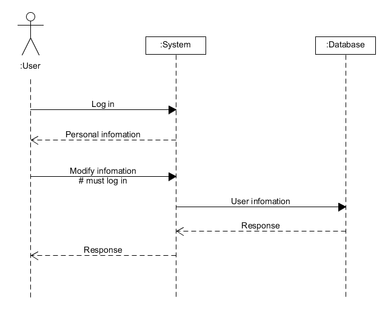

# 系统顺序图作业
- 学号：16340008
- 姓名：蔡梓珩
- GitHub：[Azuki-Azusa](https://github.com/Azuki-Azusa)
- 岗位：交互设计师，js工程师

### 应用场景
1. 用户希望更改个人信息（需要先登录），发送请求到系统。
2. 系统处理请求并发送给数据库。
3. 数据库返回请求结果到系统。
4. 系统返回请求结果，在客户端显示给用户
### 系统顺序图

