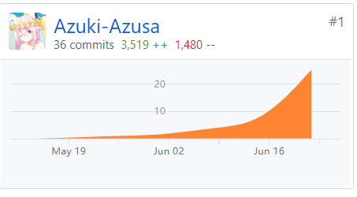

# Final Report
- 学号：16340008
- 姓名：蔡梓珩
- GitHub：[Azuki-Azusa](https://github.com/Azuki-Azusa)
- 岗位：交互设计师，js工程师
### 个人总结
在本次项目中，担任JS工程师与交互设计师。这个工作需要同时与后端和页面设计沟通。
需要与页面设计进行充分沟通，并理解视图层的代码，并对用户各种操作尽可能的模拟并测试，确保正确作出反馈，数据正确操作。需要对Mock作出各种可能的返回结果模拟仿真，确保逻辑层能正确处理返回结果并传给视图层显示。需要与视图层配合，完成一些只能在视图层修改组件实现的交互效果，提升交互体验。
在后端对接的过程，需要快速切换Mock仿真API与服务器提供的API，并对逻辑层的代码有足够深刻的理解，快速找出潜在的问题。
得益于后端与页面的同学的靠谱，最终成功完成项目。这次程序逻辑层开发将是一次宝贵的开发经验。
这次项目开发周期长，对持续开发的时间管理带来了挑战。
### PSP-2.1 统计表
PSP2.1               | 耗时
:-                         |-:
计划                   | 5%
· 估计任务时间  | 5%
开发                   | 85%
· 分析需求          |10%
· 生成设计文档  |0%
· 设计复审| 0%
· 代码规范| 0%
· 具体设计| 20%
· 具体编码| 25%
· 代码复审| 10%
· 测试| 20%
报告|5%
·测试报告| 2%
·计算工作量| 3%
事后总结，提出过程改进计划|5%
### GitHub贡献
[微信小程序前端仓库贡献](https://github.com/earn-me-some-money/emtm-wxCode/graphs/contributors)
