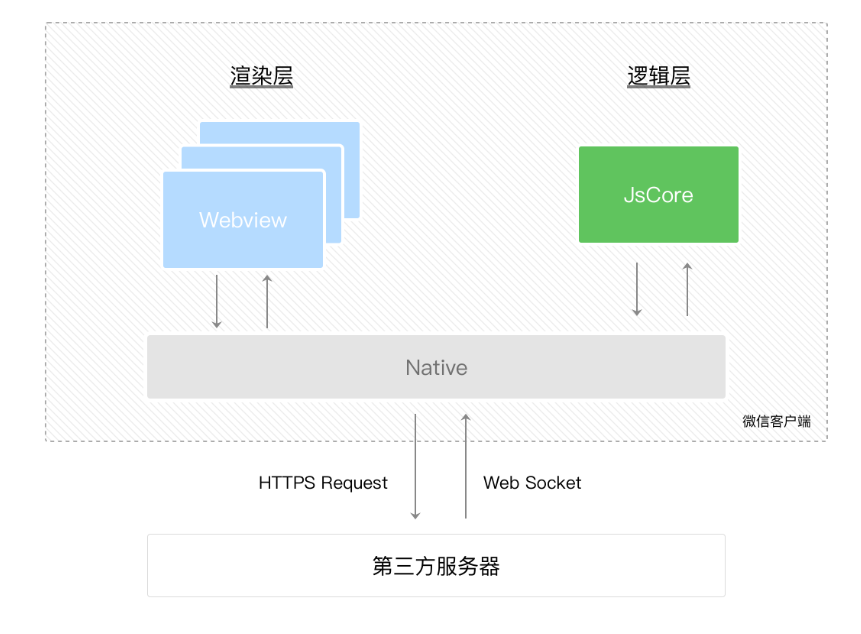
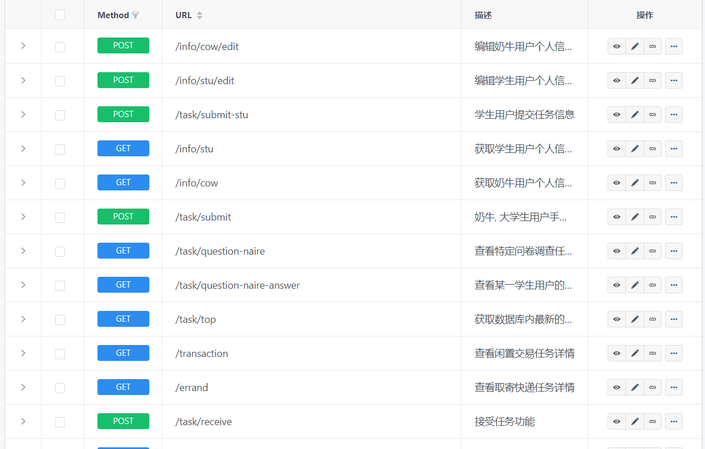

# 微信小程序应用逻辑层开发
- 学号：16340008
- 姓名：蔡梓珩
- GitHub：[Azuki-Azusa](https://github.com/Azuki-Azusa)
- 岗位：交互设计师，js工程师
### 微信小程序与网页开发的区别
微信小程序逻辑层和渲染层是分开的，分别运行在不同的线程中。因此逻辑层（JS）无法通过获取DOM对视图层（描述语言wxml和wxss）的内容直接进行修改。逻辑层运行在 JSCore 中，并没有一个完整浏览器对象。于是视图层的内容动态修改主要通过视图层绑定逻辑层里声明的变量，在逻辑层修改后发送到视图层。
### MINA框架
小程序的官方框架是MINA框架，核心是一个响应的数据绑定系统。
整个小程序框架系统分为两部分：逻辑层（App Service）和 视图层（View）。小程序在视图层与逻辑层间提供了数据传输和事件系统。渲染层的界面使用了WebView 进行渲染；逻辑层采用JsCore线程运行JS脚本。
- 数据传输
视图层绑定逻辑层的数据，在逻辑层修改数据，视图层即可作出响应。因此，只要视图层绑定好数据，即可通过改变数据使视图实现动态显示（如绑定数组实现动态列表）。因此JS无需获取视图层的DOM（由于其运行在 JSCore 中，并没有一个完整浏览器对象，也无法获取DOM）来修改视图层。
- 事件系统
视图层到逻辑层的通讯依赖事件系统。在逻辑层先声明事件处理函数，在函数中修改数据。在视图层的组件中绑定该事件处理函数，当事件触发（如Button组件被点击），事件处理函数运作，利用事件处理函数获取的参数的值来修改逻辑层中的数据。
- MINA框架

	- App Service应用逻辑层：负责逻辑处理，本地存储，网络请求等。
	- 数据显示：App Service应用逻辑层传输数据流到Native System系统层，系统层再传到页面视图层。
	- 事件处理：页面视图层将事件数据传到Native System系统层，系统层再传到应用逻辑层。
	- Native System系统层：文件系统，任务管理，网络，权限管理，JS Bridge等。
	- JS Bridge：负责逻辑层与视图层的数据传输。
### 微信原生API
小程序开发框架提供丰富的微信原生 API，可以方便的调起微信提供的能力。本次用到的API主要包括网络请求，用户信息获取，选择图片或拍照，弹框等。
wx.request：
- 微信提供的网络请求API（wx.request）为不阻塞的同步函数，因此在视图层需要正确反馈交互结果时，需要注意。需要确认请求已收到返回再修改数据或进行后续操作。
- 在使用wx.request发出一个body为json的GET请求时，会自动将其转换为字符串作为url后缀传输，因此与后端对接需要注意这一点。
### Mock
为了实现前端与后端的并行开发，前端开发需要利用Mock来后端仿真，通过快速修改Mock来调试前端逻辑实现。

这次使用了easy mock实现数据仿真。通过后端给出的API文档，在Mock上仿真接口，对应返回格式与url。通过前端自己更新mock数据，仿真调用API返回的各种可能结果，调试前端能否正确应对返回结果并修改数据。
对所有调用API的请求的Url值，其前缀统一调用一个全局可获取的变量，可通过修改该变量快速在Mock接口与真实服务器接口之间切换。
### 与视图层交互
与视图层的交互实际上就是与用户的交互。需要对视图层修改的数据或做出的行为（都是事件）作出判断，并即使反馈给视图层，实现视图层的实时更新或非法操作提示。对视图层设计的页面，有时需要修改组件属性，以减少对事件的判断复杂度，并提升用户交互体验。
### 与后端的对接
由于Mock只能仿真返回结果，可能会出现发送的数据中有bug而无法检测出来的情况。因此需要在对接时对每个功能（涉及所有API）进行测试。合理利用log打印数据，定位代码bug，确认错误在于前端还是后端。