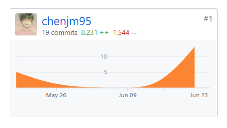

# Final Report

## 学号
16340022

## 个人总结

在本次项目中，作为项目经理，我主要负责前期调研，需求分析，用例设计，并按照项目模板编写相关项目文档。

按照项目模板对项目文档进行整理，让我体会到了一个完整项目的项目规范，积累了不少的项目开发经验。

## 主要工作清单
* 使用UMLet建模，设计用例图、活动图、领域模型、状态模型等
* 对各个用例添加用例描述，进行用例设计
* 记录会议
* 编写大量的文档

## PSP2.1统计表
| PSP阶段                        | 耗时(h) |
| ------------------------------ | ------- |
| **计划**                       | 4       |
| ·估计任务时间                  | 4       |
| **开发**                       | 86      |
| 分析需求                       | 20      |
| 生成设计文档                   | 24      |
| 设计复审                       | 10      |
| 代码规范                       | 0       |
| 具体设计                       | 32      |
| 具体编码                       | 0       |
| 代码复审                       | 0       |
| 测试                           | 0       |
| **报告**                       | 3       |
| 测试报告                       | 0       |
| 计算工作量                     | 3       |
| **事后总结，提出过程改进计划** | 10      |
| **合计**                       | 103    |

## github仓库

## 个人博客
[Atom中使用markdown插件编辑文本](16340022-Work-Report.md)

## 特别致谢
技术方面，要感谢我的前端和后端队友通力合作，尽心尽力完成整个项目。
