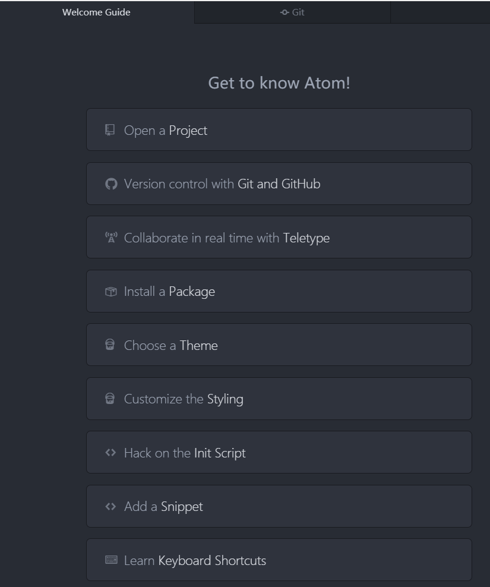
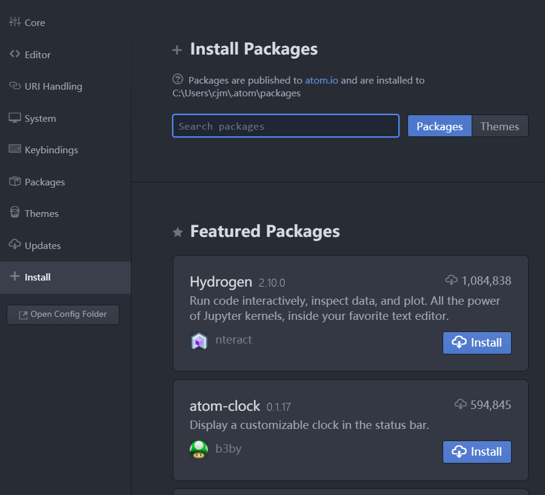
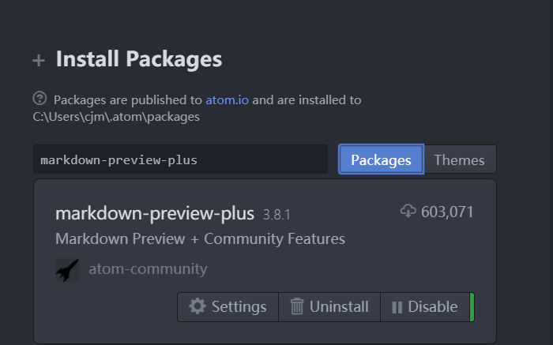
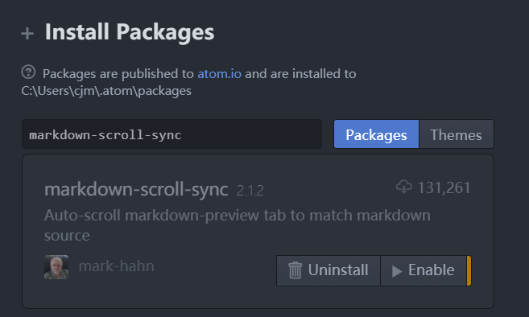
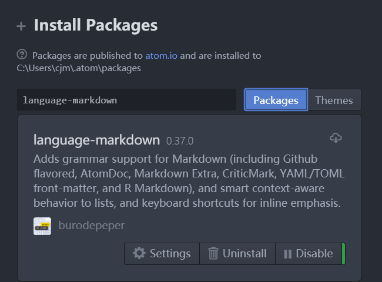
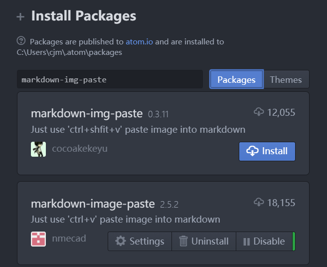
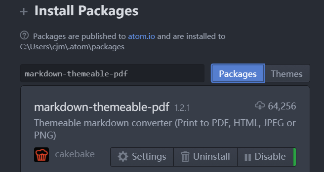

# Atom中使用markdown插件编辑文本

## Atom安装
Atom是一款简单的文本编辑器，用浏览器打开 [https://atom.io](https://atom.io),即可下载并安装Atom文本编辑器。

## 安装插件

打开Atom编辑器，在Welcome Guide界面选择Install a Package ：

在跳出的界面中输入插件名称，即可搜索并安装：

## markdown插件
* 增强预览(markdown-preview-plus)：

    Atom自带的Markdown预览插件markdown-preview功能比较简单，markdown-preview-plus对其做了功能扩展和增强，支持预览实时渲染、Latex公式。使用该插件前需要先禁用markdown-preview

    

* 同步滚动(markdown-scroll-sync):

    同步滚动是markdown编辑器的必备功能，方便翻阅文档修改时能快速定位到预览的位置。

    markdown-scroll-sync不仅支持同步滚动，在光标位置发生变更时也会同步滚动。

    

* 代码增强(language-markdown):

    一般的Markdown编辑器提供了代码着色等基本功能，language-markdown除了能给代码着色，还提供了快捷的代码片段生成等功能。

    

* 图片粘贴(markdown-img-paste):

    使用截图工具将图片复制到系统剪切板后，在markdown文件中新起一行输入文件名，直接Ctrl + shift + V 会自动把图片保存到markdown文件相同目录下，并命名为刚输入的文件名，同时在刚输入文件名行处生成img标签。
    

* 表格编辑(markdown-table-editor):

    使用markdown-table-editor可以大幅度提高表格编辑的效率。
    

* pdf导出(markdown-themeable-pdf):

    markdown-themeable-pdf插件可以轻松实现pdf导出和预览功能。
    

## 总结
Atom与markdown插件的结合，可以基本满足常见的markdown编辑需求，是不错的markdown编辑工具。
