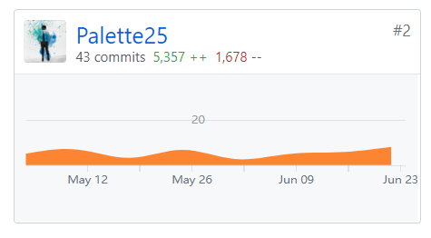
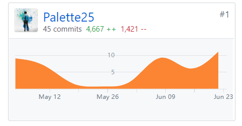
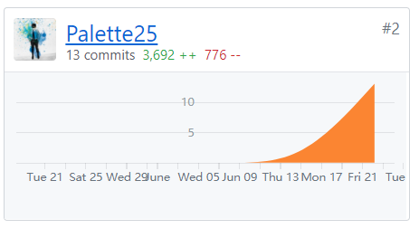

# Final Report

### 姓名：陈明亮

### 学号：16340023

### Github账号：Palette25

## 个人总结

* 在本次系分大项目中，本人主要负责使用Rust语言进行服务端的构建，需要对API进行架构，和前端保持良好的沟通，同时充分理解需求，分析并整合成最终的API设计文档。

  ​

* 本次课程作业可以说是大三下学期耗时最久的期末大项目了吧，花了很多的时间在上面，包括一开始的Rust语言基础学习，到最后的配合负责数据库的同学进行服务端的构建，测试Debug的过程虽然艰辛，但还是有所收获的。

  ​

* 总而言之，项目的完成离不开队友的配合，前后端小组的沟通交流，其他队员在本次项目上也是尽心尽力，最终完成了整体的工作。

## PSP-2.1 统计表

|    PSP阶段     | 耗时(h) |
| :------------: | :-----: |
|      计划      | 20 |
| · 估计任务时间 | 2 |
|      开发      | 120 |
|   · 分析需求   | 50 |
| · 生成设计文档 | 80 |
|   · 设计复审   | 10 |
|   · 代码规范   | 20 |
|   · 具体设计   | 50 |
|   · 具体编码   | 80 |
| ·代码复审 | 20 |
| ·测试 | 20 |
| 报告 | 20 |
| ·测试报告 | 15 |
| ·计算工作量 | 20 |
| 事后总结，提出过程改进计划 | 10 |
| 合计 | 132 |

## 贡献率说明

1. 服务端主仓库贡献(emtm-web)
  

  ​

2. 文档仓库贡献(Document)
  

  ​

3. 仪表盘仓库贡献(Dashboard)
  

  ​