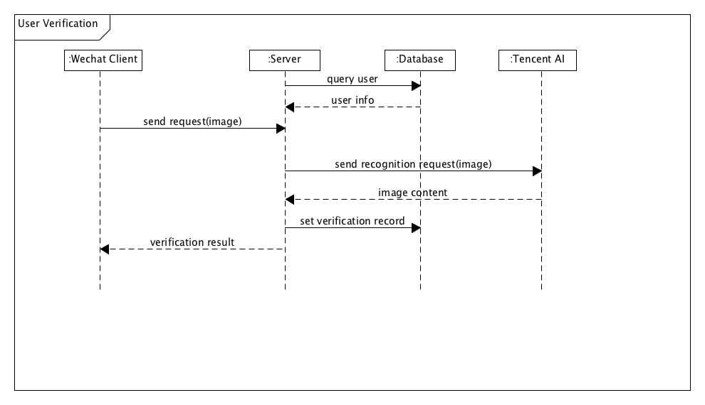

## 系统分析与设计 -- 团队作业

**16340024**

### 选取应用场景描述

用户上传照片验证身份功能：

1. 用户在客户端选择上传的图片，客户端将图片数据上传至服务端
2. 服务端处理请求，通过与数据库交互，获取到相应的用户信息
3. 服务端发送请求至腾讯 AI 开放平台获取图片内容数据
4. 腾讯 AI 开放平台将图片内容数据返回至服务端，服务端根据内容决定验证是否通过，将结果返回至客户端

### 系统顺序图

