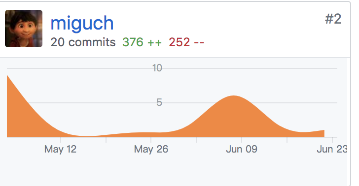
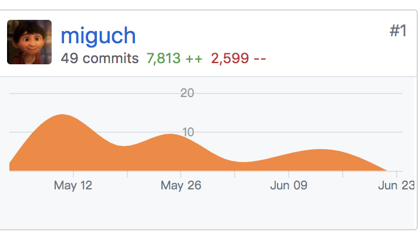
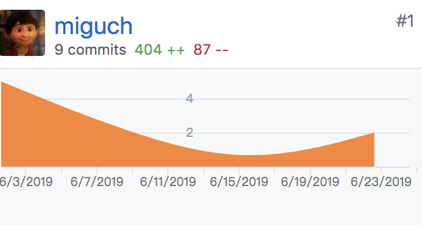
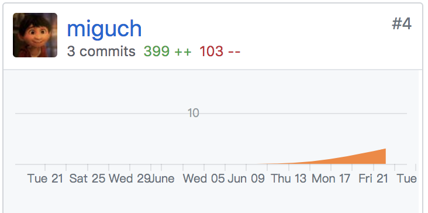

# Final Report

**16340024**

## 个人总结

- 本次系分项目中我负责的是服务端数据库读写、用户验证以、搜索功能以及服务器部署方面的工作，过程中需要在设计方面与负责 API 和负责测试的同学进行充分交流并明确需求，以完成合理的数据库设计。
- 在过程中学习了更多的 Web 框架、ORM、容器等方面的知识，对于软件开发中的工具有了更多了解
- 在整个项目过程中学习了许多软件开发整体工作的知识，也体会到了开发流程中不同环节的重要性

## PSP-2.1 统计表

|          PSP阶段           | 耗时(%) |
| :------------------------: | :-----: |
|          **计划**          |    5    |
|       · 估计任务时间       |    5    |
|          **开发**          |   75    |
|         · 分析需求         |   10    |
|       · 生成设计文档       |   10    |
|         · 设计复审         |    3    |
|         · 代码规范         |    5    |
|         · 具体设计         |   10    |
|         · 具体编码         |   30    |
|         ·代码复审          |    2    |
|           ·测试            |    5    |
|          **报告**          |   20    |
|         ·测试报告          |    2    |
|        ·计算工作量         |    3    |
| 事后总结，提出过程改进计划 |   15    |
|            合计            |   100   |

## 贡献率说明

1. 服务端 Web API 仓库贡献(emtm-web)

 

2.  服务端 Web API 仓库贡献(emtm-db)

 

  ​

3. 用户验证模块仓库贡献(emtm-verify)

 

4. Dashboard 仓库贡献

   

  ​

