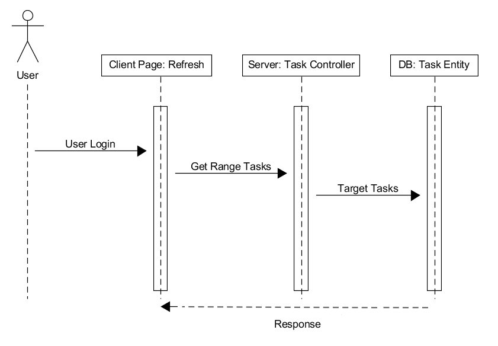

## 系统分析与设计 -- 团队作业

### 个人信息

- 学号：16340025
- Github：[Krazymud](https://github.com/Krazymud)

### 一、作业要求

### 二、选取应用场景描述

1. 用户在客户端页面进行刷新，发送对应请求（获取任务）给服务端进行任务信息获取
2. 服务端处理请求，通过与数据库交互，获取到相应的实体信息
3. 服务端返回任务详情信息，客户端将任务详情展示给用户

### 三、系统顺序图

