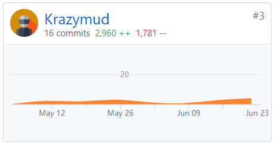
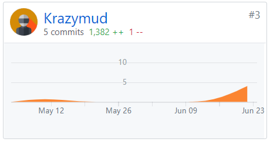
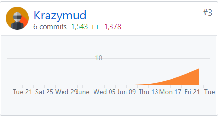

### 个人信息

- 学号：16340025
- 姓名：陈慕远
- Github：[Krazymud](https://github.com/Krazymud)

### 自我总结

本次项目中，我负责协助进行后端的开发以及项目各项功能的的测试与修正，过程中需要和前后端开发人员保持良好的沟通，充分理解代码意图，编写测试用例，最终整合得到若干部分测试文档。

在整个项目中，学习的时间与真正编码的时间可以说是平分秋色，甚至说占得更多。从最初的rust语言基础学习（rust语言对语言安全要求非常严格，它可以帮助你养成良好的编程习惯，但坏处是初学的时候是比较难受的），到学习使用rust进行单元测试、集成测试（编写黑盒测试用例），最后到JMeter压力测试工具的学习。虽然花费了很多时间，但也非常值得。

最终，项目的顺利完成离不开大家的通力合作，感谢队友的配合，前后端小组间的良好沟通，相信此次的经验会在日后帮到大家许多。

> JMeter压力测试简要入门：[传送](<https://earn-me-some-money.github.io/Dashboard/16340025-Reports/16340025-Work-Report.html>)

### PSP2.1统计表

|                PSP2.1                 | Time(%) |
| :-----------------------------------: | :-----: |
|             **Planning**              |  **9**  |
|               Estimate                |    9    |
|            **Development**            | **81**  |
|               Analysis                |   13    |
|              Design Spec              |   13    |
|             Design Review             |    3    |
|            Coding Standard            |    2    |
|                Design                 |   10    |
|                Coding                 |   15    |
|              Code Review              |    5    |
|                 Test                  |   20    |
|             **Reporting**             | **10**  |
|              Test Report              |    1    |
|           Size Measurement            |    1    |
| Postmortem & Process Improvement Plan |    8    |

### Git统计

**server端**

**Document仓库**

**DashBoard**

