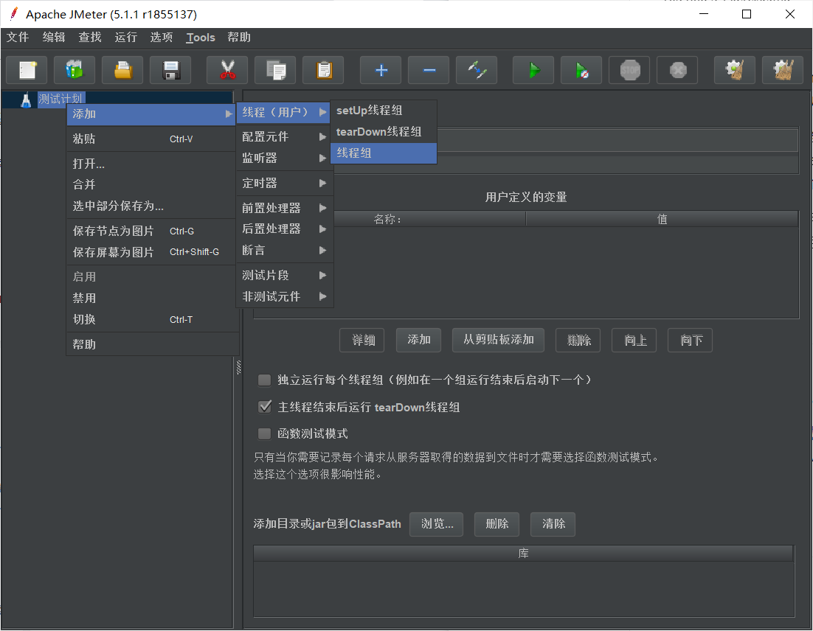
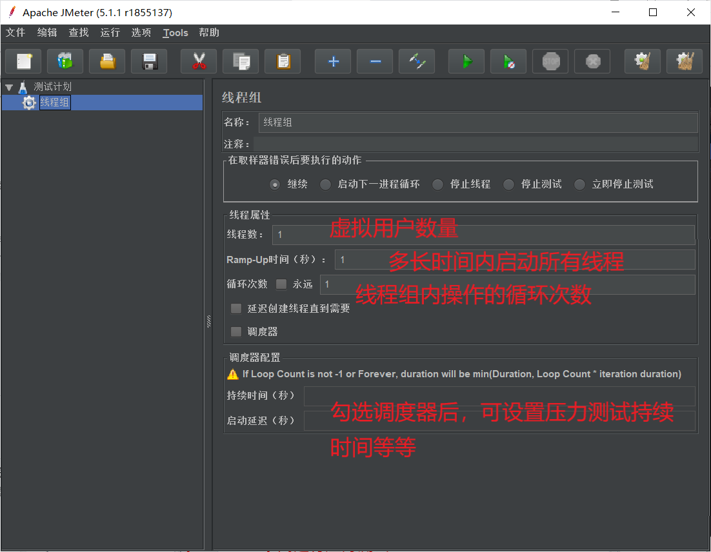
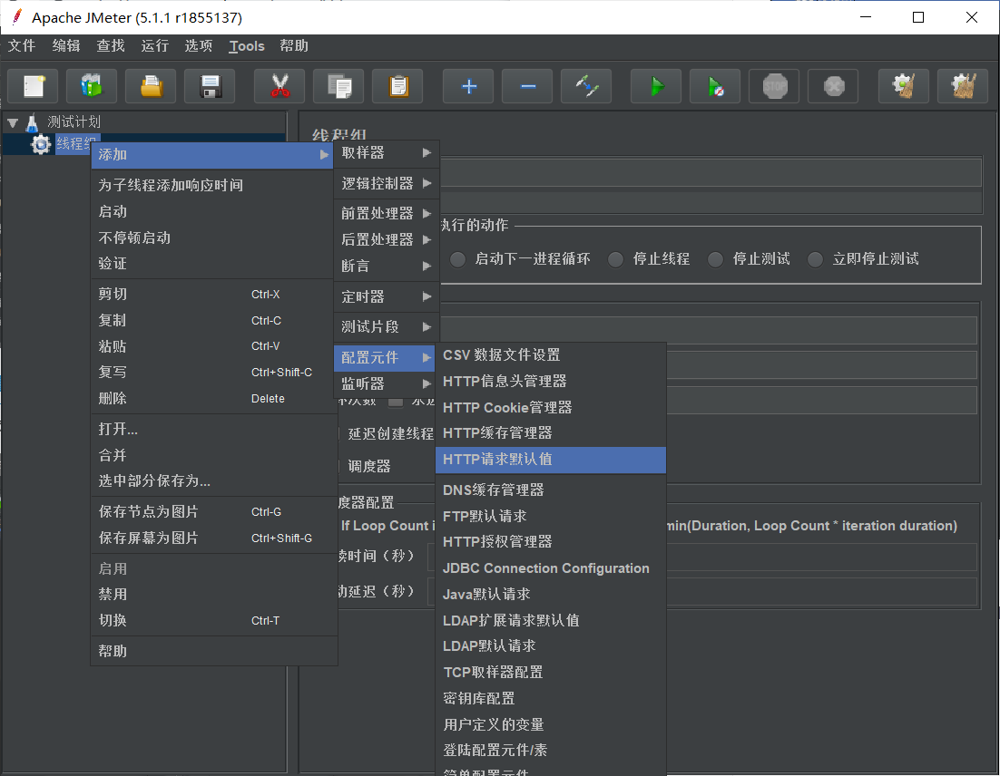
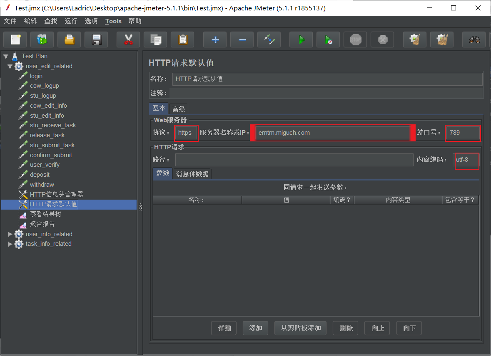
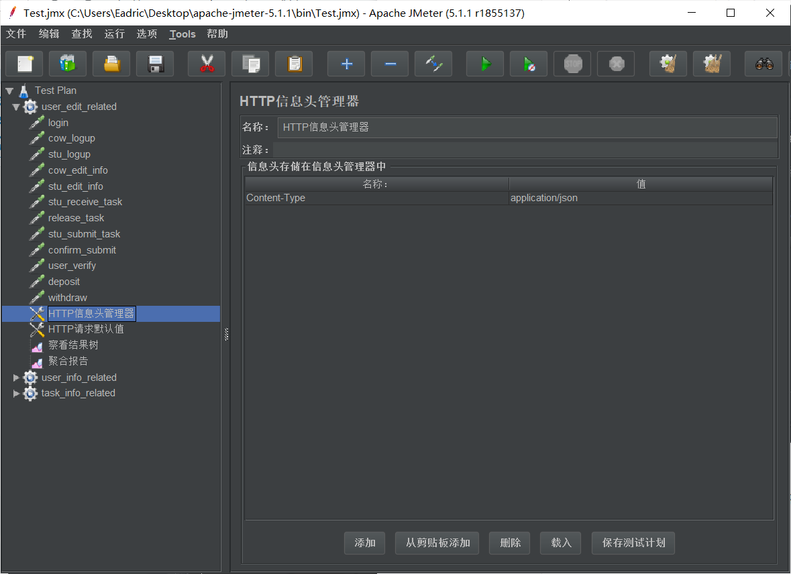
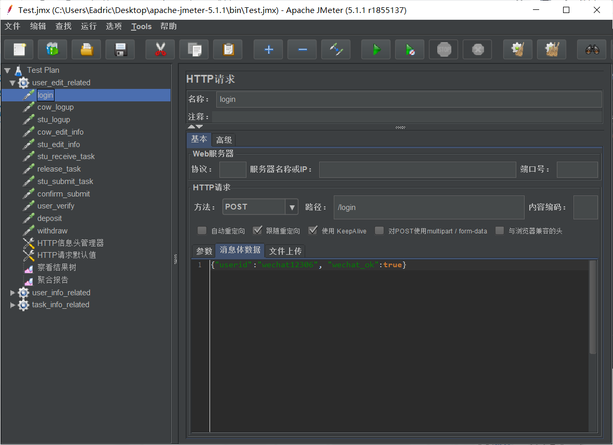
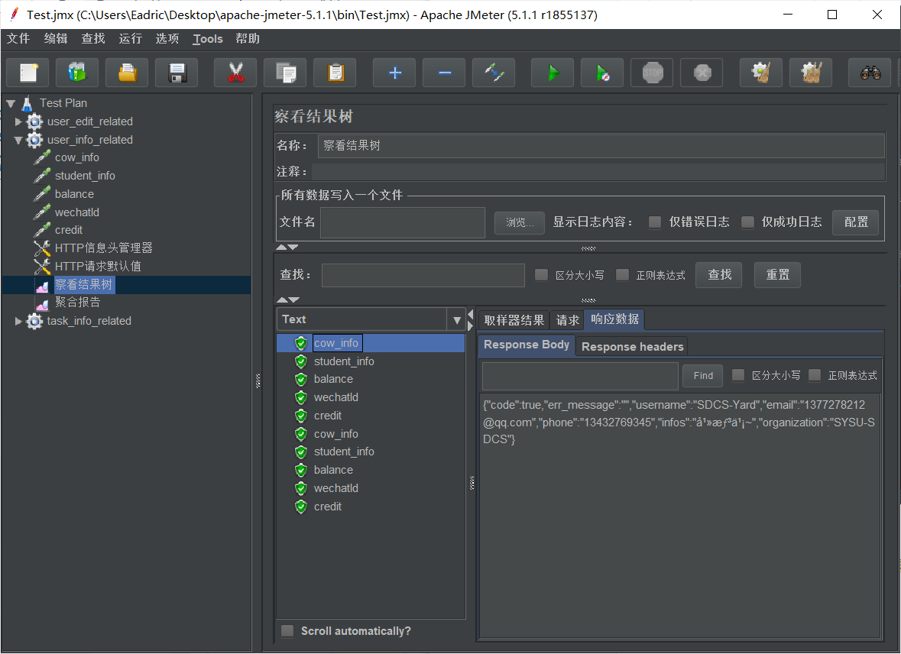
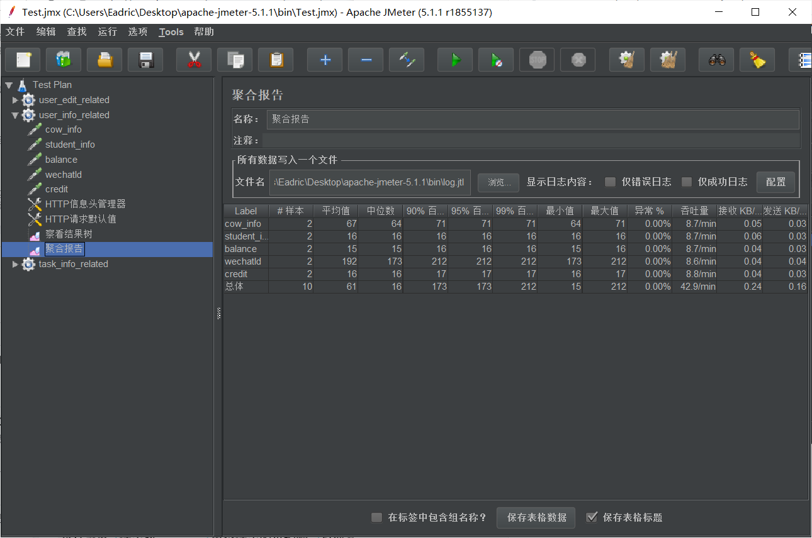

# JMeter压力测试入门

## 前言

压力测试是每一个Web应用程序上线之前都需要做的一个测试，它可以帮助我们发现系统中的瓶颈问题，减少发布到生产环境后出问题的几率；预估系统的承载能力，使我们能根据其做出一些应对措施。所以压力测试是一个非常重要的步骤。

压力测试可以借助许多工具进行，这里选择使用JMeter这样一个开源的工具。

## JMeter简介

Apache JMeter是Apache组织开发的基于Java的压力测试工具。用于对软件做压力测试，它最初被设计用于Web应用测试，但后来扩展到其他测试领域。

JMeter可以用于测试静态和动态资源，例如静态文件、Java 小服务程序、CGI 脚本、Java 对象、数据库、FTP 服务器，等等；JMeter还可以用于对服务器、网络或对象模拟巨大的负载，来自不同压力类别下测试它们的强度和分析整体性能。

另外，JMeter能够对应用程序做功能/回归测试，通过创建带有断言的脚本来验证你的程序返回了你期望的结果。为了最大限度的灵活性，JMeter允许使用正则表达式创建断言。

## 下载与安装

- 安装配置JAVA环境，因为JMeter是基于JAVA的测试工具
- 可在[官网](https://jmeter.apache.org/download_jmeter.cgi)下载JMeter工具包，解压后进入bin文件夹，运行jmeter.sh或jmeter.bat
- 如有需要，还可[下载](http://jmeter-plugins.org/downloads/all/)许多插件以扩展更多功能。只需将下载的压缩包解压后将JMeterPlugins-Standard.jar放在X\Apache\jmeter\lib\ext下

  ## JMeter各页面操作展示

> 添加线程组

> 线程组对应含义

> 为线程组配置元件，如HTTP请求默认值

> HTTP请求默认值窗口可以配置我们需要进行测试的程序协议、地址和端口

> http信息头管理器可以管理所有http请求的头信息

> 添加http请求，设置消息体数据

> 添加查看结果树，其可监听测试结果

> 添加聚合报告

JMeter聚合报告参数解析：

- Label：JMeter的每个HTTP Request的name属性值
- Samples：请求数，表示本次测试一共发出了多少个请求
- Average：单个HTTP Request的平均响应时间
- Median：50%用户的响应时间
- 90% Line：90%用户的响应时间
- 95% Line：95%用户的响应时间
- 99% Line：99%用户的响应时间
- Min：最小响应时间
- Max：最大响应时间
- Error%：错误率，即错误请求数 / 请求总数
- Throughtput：吞吐量，每秒完成的请求数
- Received KB/Sec：每秒从服务器端接收到的数据量
- Sent KB/Sec：每秒发送到服务器端的数据量

