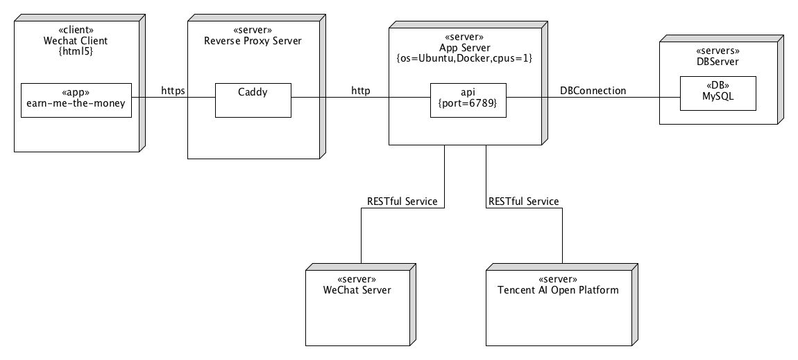

# Earn-Me-The-Money Deploy Instructions

| 版本 | 日期      | 描述                       | 作者   |
| ---- | --------- | -------------------------- | ------ |
| 0.1  | 2019.6.23 | 服务器部署相关的介绍与说明 | Miguch |

## 架构图



## 部署流程

### Caddy 安装

根据 [Caddy 官网](https://caddyserver.com/download) 的指引下载或根据 [Caddy Wiki](https://github.com/mholt/caddy/wiki/Plugging-in-Plugins-Yourself) 上的指引添加扩展后编译。

### Caddyfile 编写

项目仅需要配置 Caddy 的反向代理功能，编写较为简单：

```caddyfile
xxx.yyy.zzz {
	header / {
    		Access-Control-Allow-Origin  *
    		Strict-Transport-Security "max-age=31536000;"
	}
	tls xxx@yyy.zzz
	proxy / http://127.0.0.1:6789
}
```

根据如上配置 Caddy 可自动申请对应`xxx.yyy.zzz`的 TLS 证书并开启 HSTS。反向代理将把所有请求发至6789端口。

### Docker 安装

根据[Docker 官网](https://docs.docker.com/install/linux/docker-ce/ubuntu/)上不同系统的指引进行安装

### Docker Compose 安装

根据[Docker 官网](https://docs.docker.com/compose/install/)上不同系统的指引进行安装

### 使用阿里云容器构建服务

由于 Rust 语言编译时间较长，在性能较弱的服务器上进行构建不太现实，因此可以使用阿里云提供的**容器镜像服务**来进行自动构建。步骤如下：

1. 登录阿里云账户
2. 在阿里云容器镜像服务控制台-访问凭证中创建`docker login` 时使用的固定密码
3. 在阿里云容器镜像服务控制台-镜像仓库中创建仓库并连接 GitHub 仓库，注意由于国内访问`crates.io`资源时连接较差此处建议选择在海外服务器构建
4. 在 git 仓库中创建 commit，并为需要用于构建容器的 commit 记录创建 tag，方法为`git tag -a release-v$version -m "Update ...."`，其中`$version`为版本号。
5. 在服务器通过`sudo docker login --username=$username registry.cn-hangzhou.aliyuncs.com`与固定密码登录阿里云颈项服务
6. 使用`sudo docker pull registry.cn-hangzhou.aliyuncs.com/$namespace/$repo:[镜像版本号]`拉取镜像
7. 使用`docker tag emtm-service registry.cn-hangzhou.aliyuncs.com/$namespace/$repo:[镜像版本号]` 标记镜像名称供 composer 使用

我们官方创建的镜像地址为`registry.cn-hangzhou.aliyuncs.com/emtm-web/emtm-service`

### 在`.env`文件中填写信息

`.env`文件中需要的信息如下：

```
TENCENT_APP_ID=$APPID
TENCENT_APP_KEY=$APP_KEY
EMTM_INDEX_DIR=./emtm-indexes/
```

其中`TENCENT_APP_ID`与`TENCENT_APP_KEY`来源于腾讯 AI 开放平台。`EMTM_INDEX_DIR`为搜索功能的索引存储路径。`DATABASE_URL` 在 docker-compose中设置因此可不需要在`.env`中设置。

### 使用 docker compose 部署

```shell
docker-compose up -d
```

