@[toc]

# 一、登陆和认证
进入微信小程序，个人页面，注册：

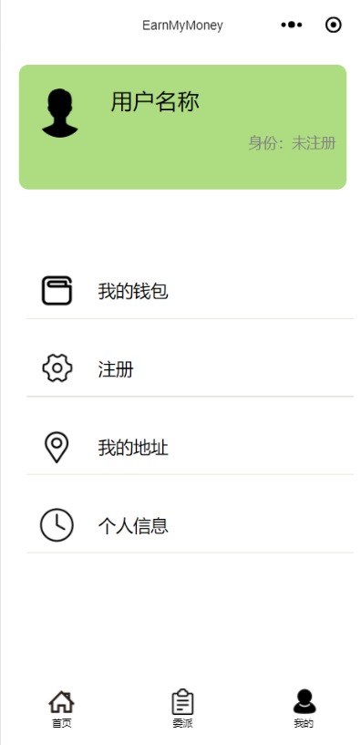

授权：

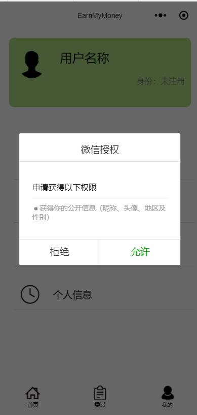

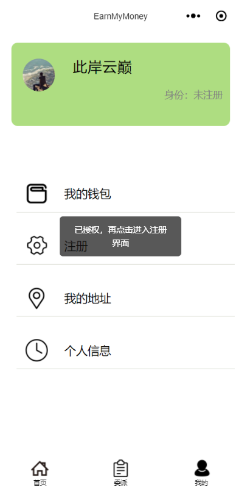

注册：

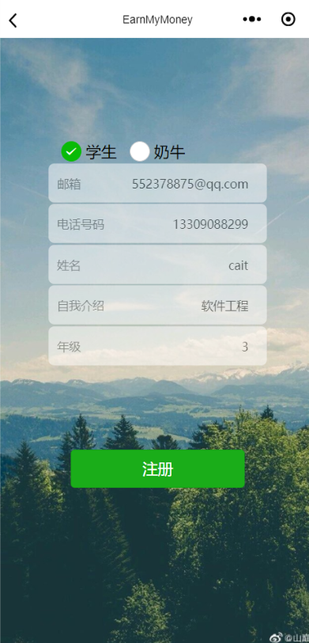

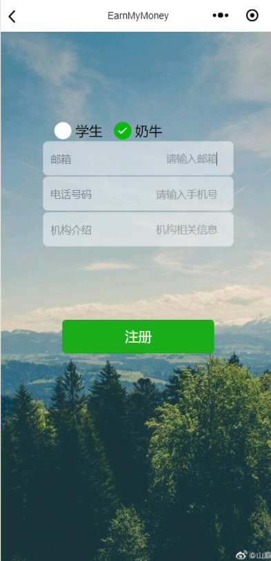

认证：

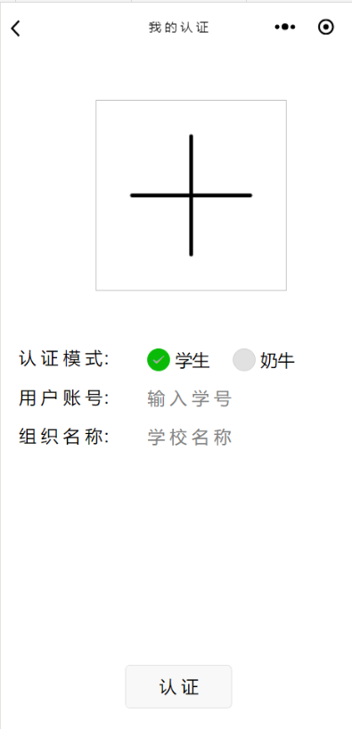

# 二、 查看首页推荐任务

推荐任务列表：

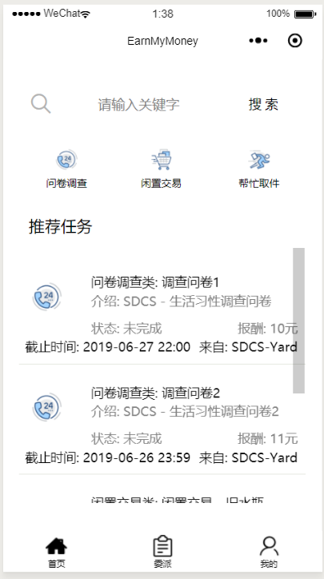

按任务类别进行查看：

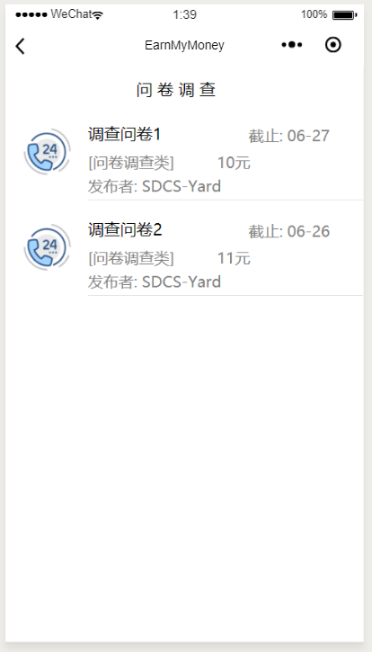

查看任务详情：

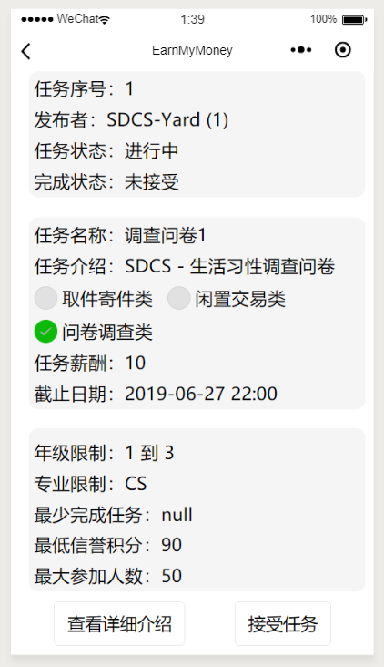

接受任务：

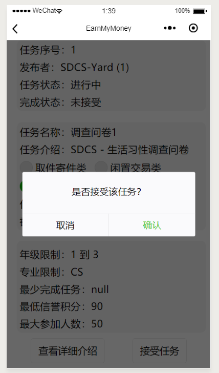

接受任务失败，不满足任务要求：

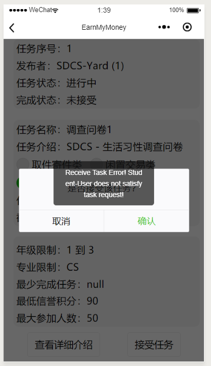

接受任务成功：

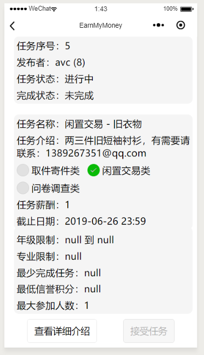

按关键字查询任务：

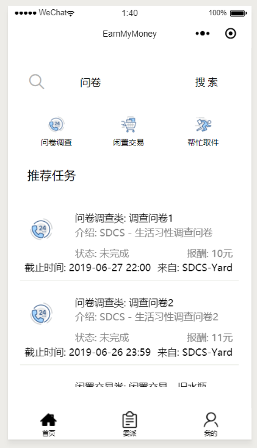

查询结果：

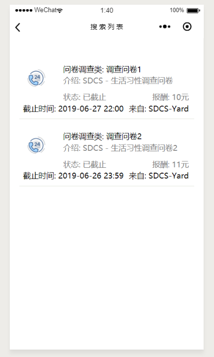

## 三、 查看我的任务

查看已接收任务

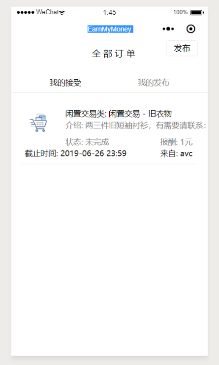

发布新任务：

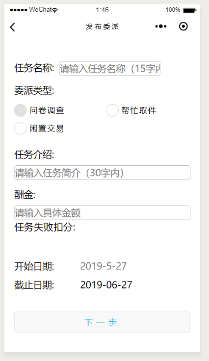

## 四、  个人页面说明

查看我的钱包

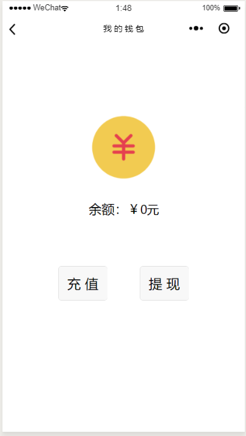

编辑和添加地址

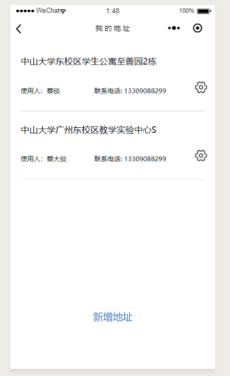

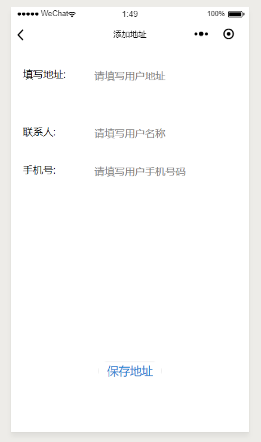

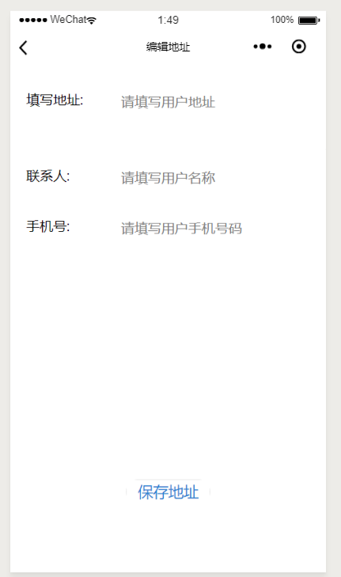

查看个人信息

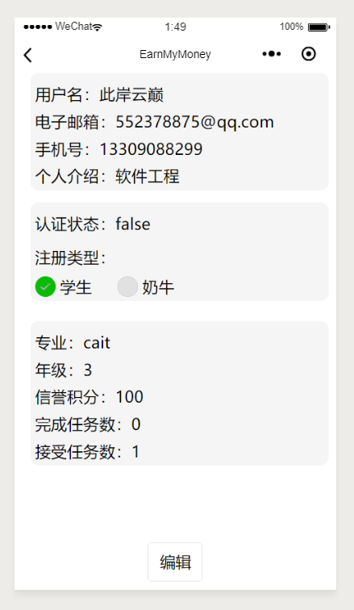

编辑个人信息

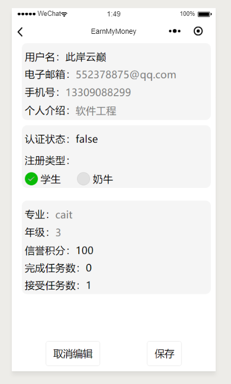

