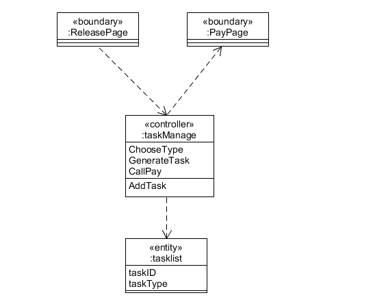

| 版本 | 日期      | 描述     | 作者     |
| ---- | --------- | -------- | -------- |
| v1.0 | 2019-6-02 | 用例设计 | chenjm95 |

# About
本文档给出了两个关键用例：奶牛发布任务和学生接受任务的用例图、顺序图和类图

# 奶牛发布任务

* 用例图

* 顺序图

* 类图

# 学生接受任务

* 用例图

* 顺序图

* 类图

