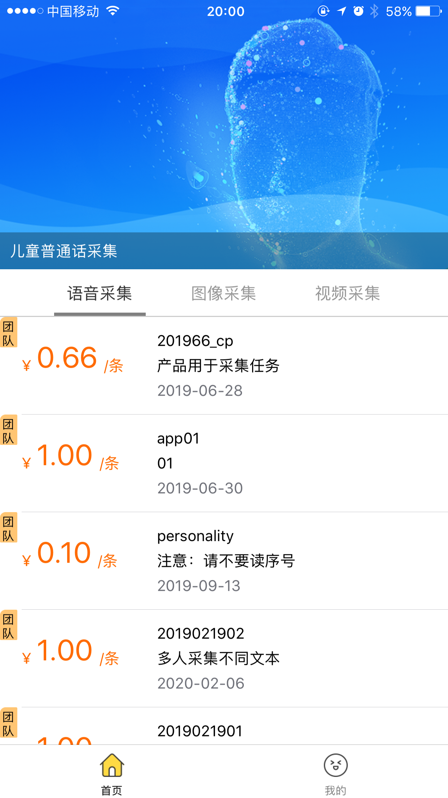
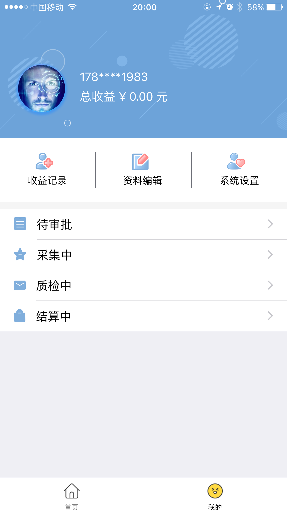
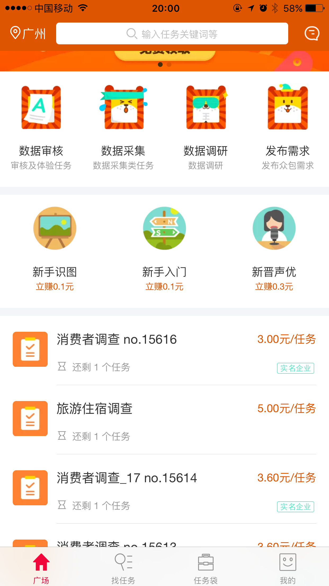
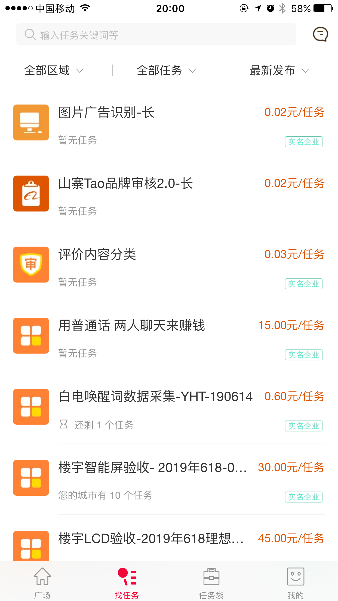
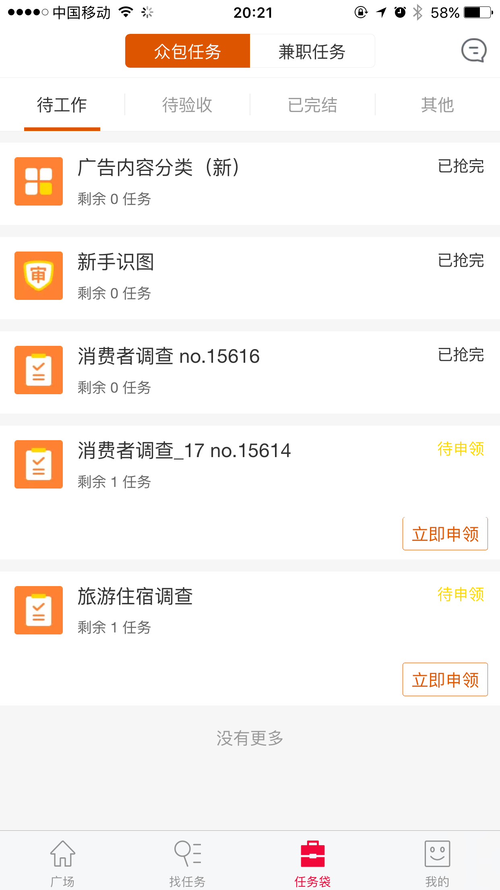
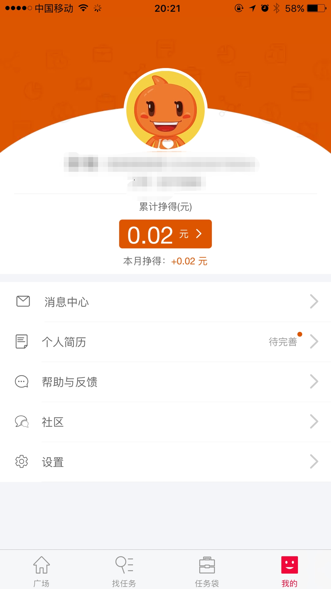
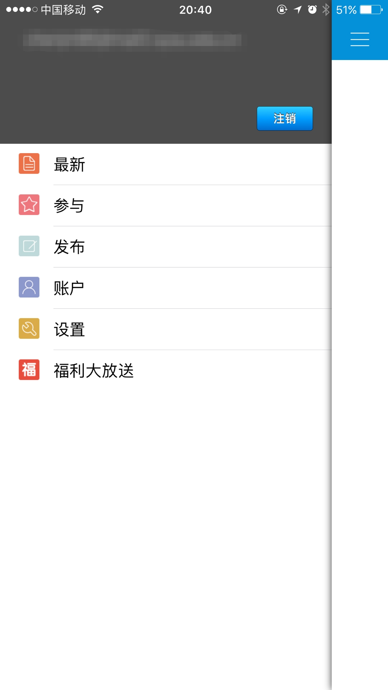
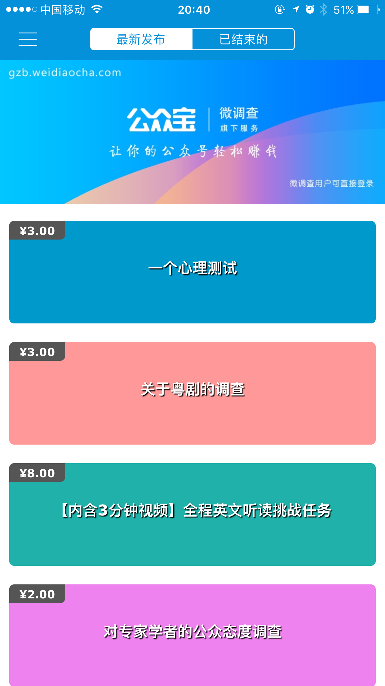
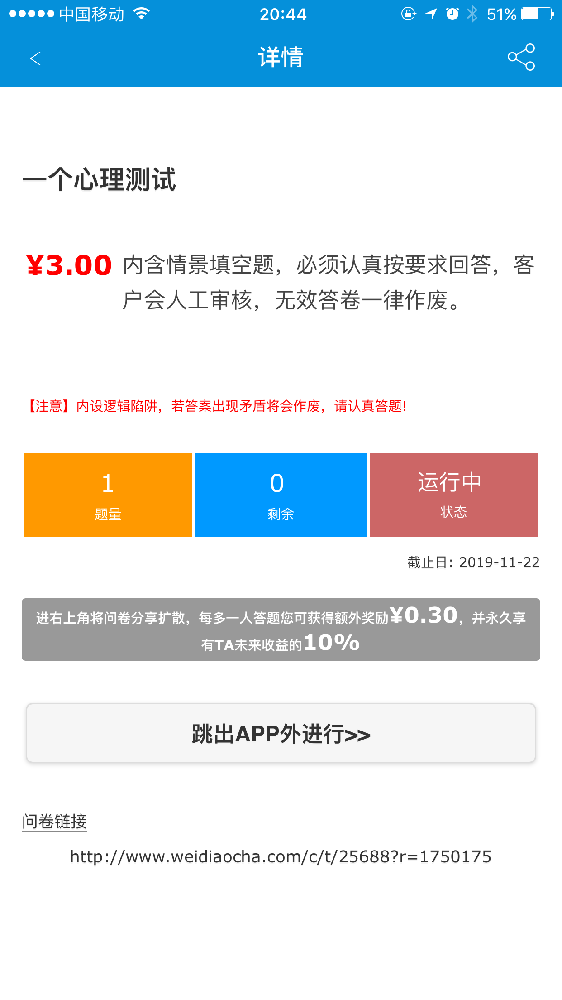

| 版本 | 日期      | 描述 | 作者   |
| ---- | --------- | ---- | ------ |
| V1.0 | 2019.5.21 | 项目调研 | chenjm95 |

# 挣闲钱项目前期调研

## 背景
消费欲望与消费能力的不匹配是当代大学生普遍面临的一个问题。有限的生活费有时不足以支撑学习资料、娱乐饮食、恋爱等消费，于是很多大学生通过各种途径寻求兼职，以获得一定的收入。但是，一般的兼职大多费时费力，对学业繁重的大学生群体很不友好。

在这种背景下，我们希望设计一个在线挣闲钱系统，让大学生能在完全空闲的时间，通过做任务的形式获取酬劳，满足自身的一些消费需求。

通过市场分析，我们发现目前市场上同类型的软件虽然不少，但远没有达到普及的程度，用户对这些产品的了解很少。

另外，由于历史原因，网上还存在着许多有关在线挣钱的骗术，因此，很多大学生对此类软件可能会心生畏惧，担心其安全性，这也是我们要考虑的一个因素。

## 竞品分析
我们选取了全民任务，阿里众包，微调查等三款产品进行分析。

### 全民任务
* 核心界面截图：

* 功能分析：全民任务APP的主要功能是人工智能数据采集业务，该业务可以分为三个类型：语音采集，图像采集，视频采集
* 流程分析：用户做任务主要经过以下几个流程：采集练习，资格审核，领取任务，提交信息，信息质检，任务结算。在实际进行过程中，存在着审核周期长，任务结算太慢的问题，让用户的时间付出与获得的收益明显不匹配
* 亮点特色：UI界面设计比较清晰简洁，任务可完成性高
* 不足之处：任务流程较为繁琐且低效，任务较少，功能单一，不足以满足大学生团体的需求

### 阿里众包
* 核心界面截图：

* 功能分析：阿里众包APP相比于全民任务APP，功能明显多样化，提供数据审核、数据采集、数据调研等业务，同时提供发布众包需求的功能。由于功能多样化，因此在任务广场外，还添加了找任务的功能，用户可以根据自己的需求，按照类型、区域等条件筛选任务。用户所接受的任务在任务袋中显示
* 流程分析：用户选择一项任务进行申领，在完成任务后等待验收结算即可
* 亮点特色：功能多样，流程简便
* 不足之处：适合普通大学生的调研很少，经常调研做到一半，由于不符合条件而直接终止，用户花了时间却不能得到任何收益，体验极差；发布众包需求只支持企业，不支持个人

### 微调查
* 核心界面截图：

* 功能分析：微调研APP主体功能就是问卷调查，支持问卷接受和问卷发布
* 流程分析：用户接受一项调查问卷后，在线填写问卷，成功答完问卷后即可获得收益
* 亮点特色：流程简便，收益快速
* 不足之处：UI设计不是很友好；同阿里众包的问卷调查一样，适合大学生的问卷不多，这样的问卷填到中途，会突然因为不符合要求而终止，无法获得收益，体验极差

## 总结
分析了三款APP后，我们发现目前市面上的众包类APP虽然不少，但是真正适合大学生的却几乎没有。

譬如问卷调查，由于几乎没有APP会明确参与调查人员的要求，但问卷内部却设置了苛刻的要求，常使得参与调查的人无法完成整个调查，无法获得收益。因此，我们希望在我们的产品中所出现的问卷调查主要是面向大学生群体，从而避免无法完成问卷的窘境。

同时，我们还将设计一些贴近大学生群体的业务，譬如闲置交易，取快递等，大学生在通过我们的系统挣闲钱的同时，也能通过发布任务来获取便利。另外，为满足大学身的需求多样性，我们还将允许用户对任务内容进行自定义。

我们的产品定位是面向大学生群体，致力于为大学生打造一个方便贴心的在线挣闲钱与交易平台。
