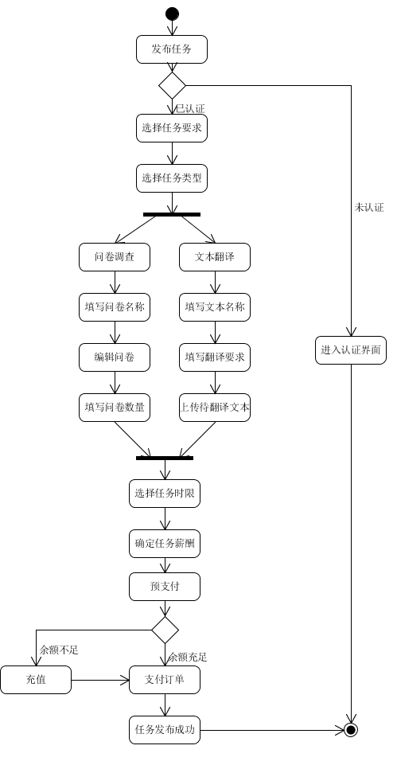

| 版本 | 日期      | 描述 | 作者   |
| ---- | --------- | ---- | ------ |
| v1.0 | 2019-5-16 | 奶牛发布任务 | chenjm95 |

**用例名称**：任务发布

**范围**：奶牛服务系统

**级别**：用户目标

**主要参与者**：需要发放任务的众包机构（称为“奶牛”）

**涉众及其关注点**：
* 奶牛：基于自身需要，发放任务给平台

**前置条件**：完成资格认证

**成功保证（后置条件）**：系统记录任务信息，等待任务被接受

**主成功场景（基本流程）**：
1. 奶牛选择发布任务，进入任务发布界面
2. 设定任务接受者需要满足的条件（年级、专业等）
3. 选择任务类型（[问卷调查](/imgs/问卷调查.png)与[文本翻译](/imgs/文本翻译.png)）
4. 编辑任务
5. 选择任务时限
6. 确定任务薪酬，账户余额预支付
7. 任务发布成功

**扩展（替代流程）**：
* 1a. 奶牛在选择发布任务后，若系统判定未完成资格认证，则不能发布任务，系统提示是否选择进行认证
* 6a. 账户余额不足时，不能完成支付，系统提示是否进行充值

**特殊需求**：任务发布界面应简洁友好

**技术与数据变元表**：
* 4a.文件上传

**发生频率**：可能会不断地发生

**未决问题**：
* 文件上传大小限制
* 任务类型比较单一

**活动图**

奶牛发布任务：

