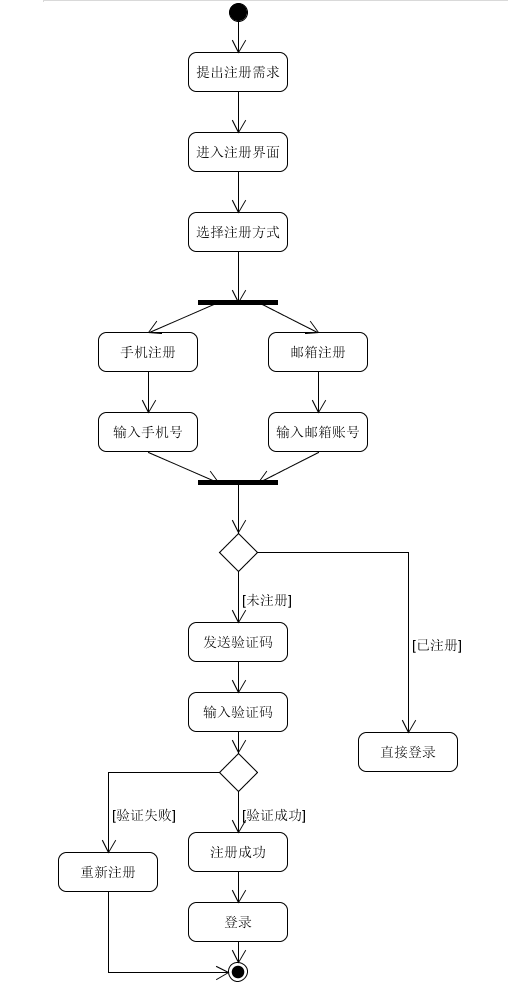
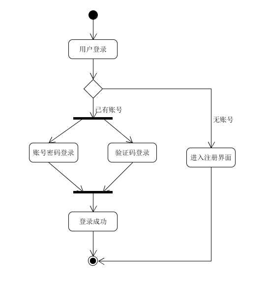

| 版本 | 日期      | 描述 | 作者   |
| ---- | --------- | ---- | ------ |
| v1.0 | 2019-5-16 | 注册登录 | chenjm95 |

**用例名称**：奶牛与学生注册登录

**范围**：earnPay挣闲钱系统

**级别**：用户目标

**主要参与者**：需要发放任务的众包机构（称为“奶牛”），发放与接收任务的学生

**涉众及其关注点**：
* 奶牛：通过注册成为挣闲钱系统的用户，登录系统发布任务，收集所需要的信息
* 学生：通过注册成为挣闲钱系统的用户，登录系统接收任务挣取闲钱，或发布任务寻求帮助

**前置条件**：用户主体了解基础的注册登录流程，提供手机号或邮箱进行注册

**成功保证（后置条件）**：注册后账号信息录入数据库，用户可进行登录，进入系统

**主成功场景（基本流程）**：

奶牛与学生的注册登录流程基本相同，如下：

1. 用户进入登录页面，如未注册，则进入注册流程：

    11 用户进入注册页面，填写账户名、密码，确认密码

    12 用户选择邮箱或手机注册，输入邮箱或手机号，获取验证码，验证成功后即注册成功

2. 如已注册或者注册完成后，用户选择登录方式：验证码登录或者账号密码登录，输入信息无误后即可成功进入系统

**扩展（替代流程）**：
* 2a 用户忘记密码：通过验证码方式重置密码

**特殊需求**：界面简洁明了

**技术与数据变元表**：
* 12a.短信验证或邮箱验证

**发生频率**：可能会不断地发生

**未决问题**：
* 为了简化注册登录的过程，在注册阶段不考虑用户身份认证的问题
* 第三方登录

**活动图**

注册业务：

登录业务：

