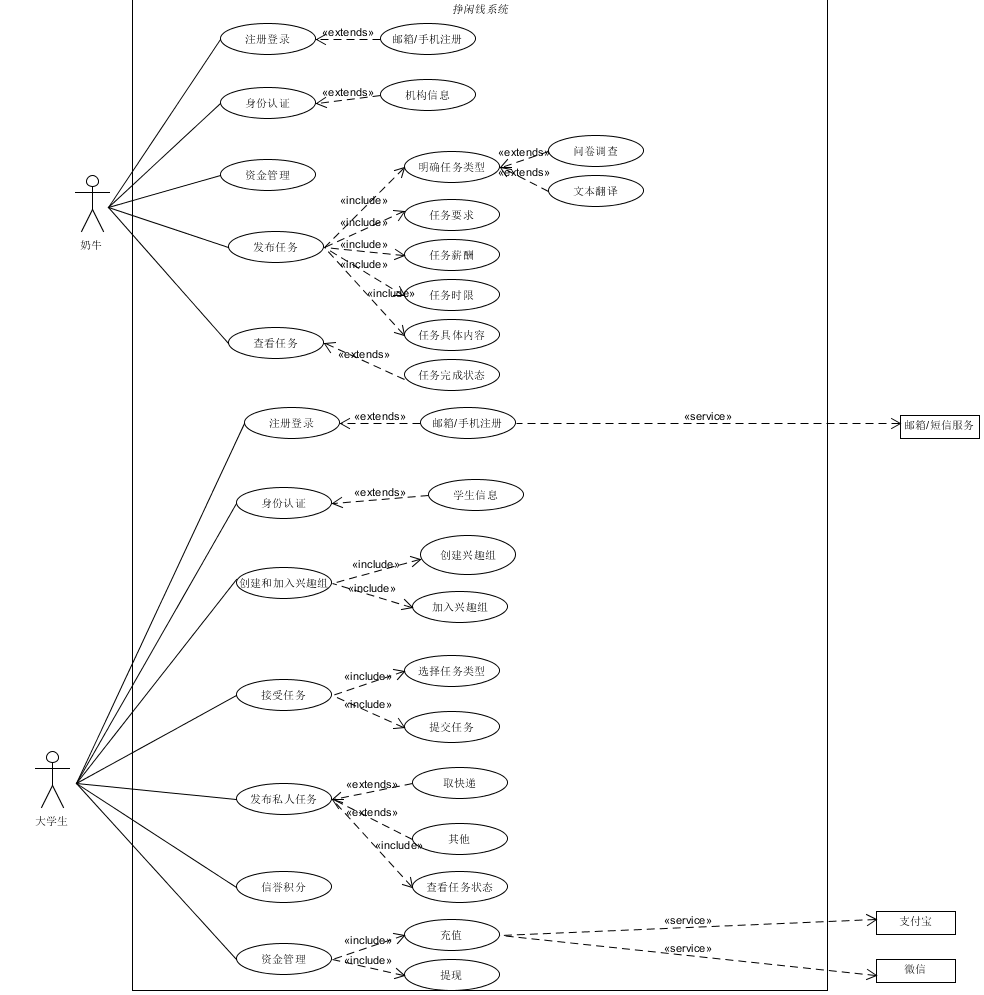
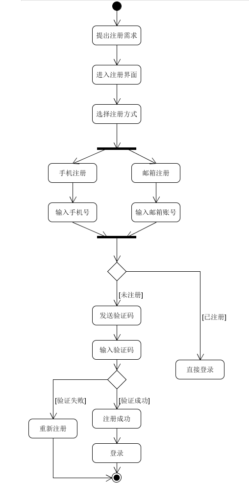
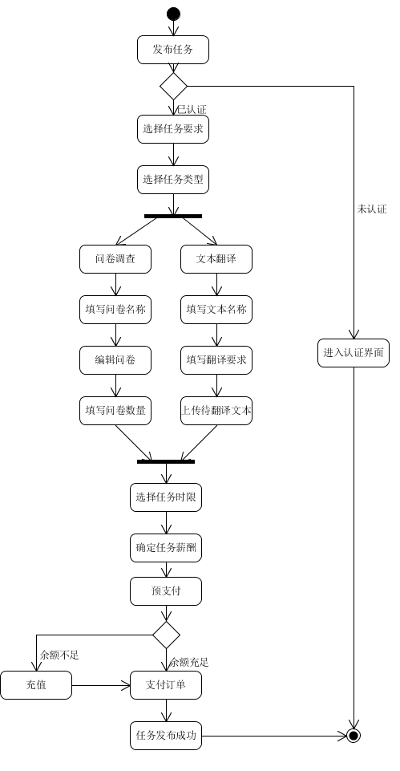
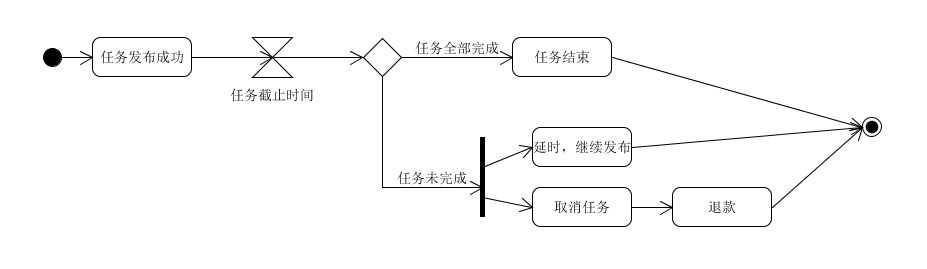
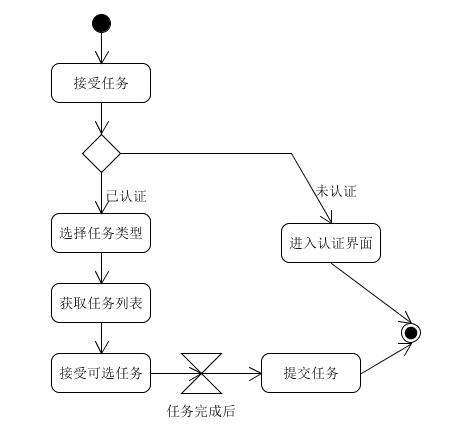
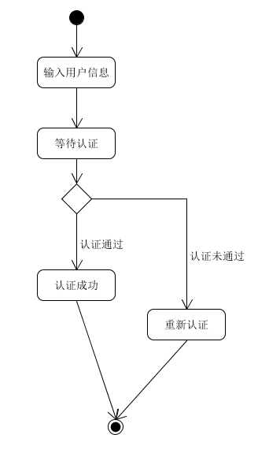
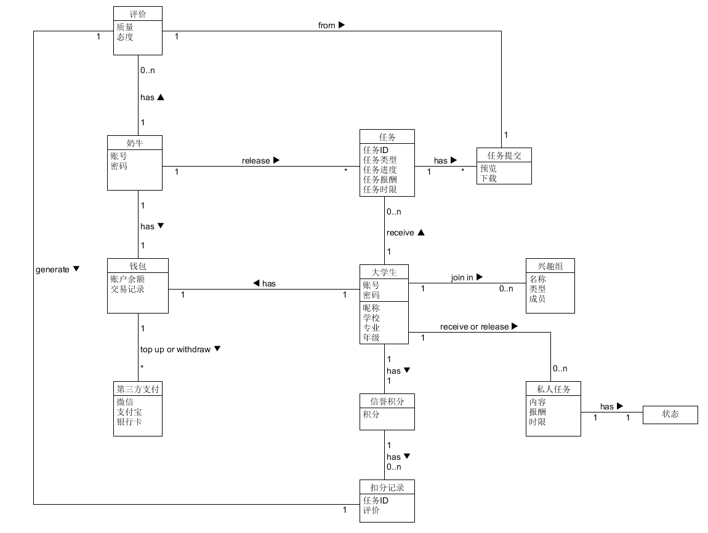
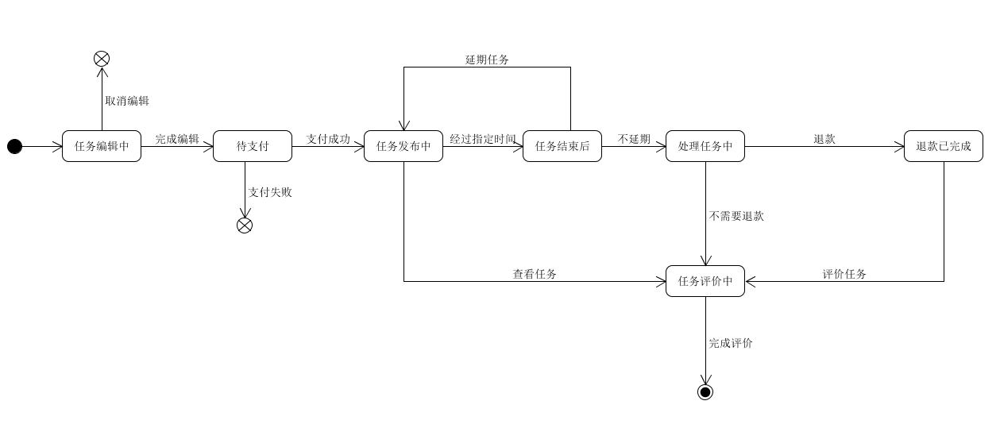

# 需求规格说明书

## 一、用例图及活动图

### Usecase-diagram
下图为整个系统的用例一览，具体用例描述见UseCases文档

### Activity-diagram

* 注册业务：

* 登录业务：

* 奶牛发布任务：

* 奶牛回收任务

* 学生接受任务

* 身份认证

更多业务过程描述见UseCases文档。

## 二、用例文本分析

**通用业务：**

[注册登录](https://github.com/earn-me-some-money/Dashboard/blob/master/Requirement_specification/注册登录.md):奶牛和学生共用相同的注册登录业务。

[身份认证](https://github.com/earn-me-some-money/Dashboard/blob/master/Requirement_specification/身份认证.md):奶牛和学生都需要进行身份认证，认证成功后才可以发布与接受任务。

[资金管理](https://github.com/earn-me-some-money/Dashboard/blob/master/Requirement_specification/资金管理.md):我们的系统中流通的货币是“闲钱币”，因此需提供充值与提现业务。

**奶牛业务：**

[发布任务](https://github.com/earn-me-some-money/Dashboard/blob/master/Requirement_specification/奶牛发布任务.md):奶牛完成身份认证之后，可以发布任务，主要支持[问卷调查业务](/imgs/问卷调查.png)和[文本翻译业务](/imgs/文本翻译.png)。

[查看任务](https://github.com/earn-me-some-money/Dashboard/blob/master/Requirement_specification/奶牛查看任务.md):奶牛通过此业务可以查看所发放任务的进步，收到的任务提交的内容等。

**学生业务：**

[创建和加入兴趣组](https://github.com/earn-me-some-money/Dashboard/blob/master/Requirement_specification/学生创建和加入兴趣组.md):兴趣组功能让学生们在社区中可以发现志同道合的小伙伴，结实新朋友。

[信誉积分](https://github.com/earn-me-some-money/Dashboard/blob/master/Requirement_specification/学生信誉积分.md):为了督促学生认真完成任务，对自己的行为负责，我们引入了信誉积分系统，通过不能接单等方式对违规行为进行处罚。

[接受任务](https://github.com/earn-me-some-money/Dashboard/blob/master/Requirement_specification/学生接受任务.md):学生在完成身份认证后，可以接受任务，完成任务后进行提交。

[发布私人任务](https://github.com/earn-me-some-money/Dashboard/blob/master/Requirement_specification/学生发布私人任务.md):考虑到学生之间进行交互的需求，我们在系统中添加了此业务，让学生可以自由发布任务，也增添了任务的多样性。

## 三、领域模型分析

系统的领域模型如下：

## 四、状态模型分析

对奶牛发布的任务进行状态建模。

* 状态集合S={任务编辑中， 待支付， 任务发布中， 任务结束后， 处理任务中， 任务评价中， 退款已完成}

* 常见事件E={取消编辑， 完成编辑， 支付失败， 支付成功， 查看任务， 评价任务， 退款， 延期任务... }

状态模型如下：

## 五、补充规格说明

### 功能性
* 推荐系统：根据用户的个人喜好对部分任务进行优先展示
* 信息汇总：对于问卷调查业务，将收到的问卷信息进行汇总，让任务发布者能够粗略感受调查结果
* 任务管理：每个任务有明确的类别，个人的任务清单中，发布、接受、完成、未完成的任务可以清楚的区分开来

### 可用性
* 注册登录：每个微信号仅可以注册一个奶牛或学生身份，注册后再次登录便以此身份在系统中活动
* 自定义任务：用户可以自定义发布任务的内容，更能满足不同用户的多样化需求
* 报酬给付：所有任务发布者都需要预支付报酬，当任务完成条件触发时，此报酬自动进入接受者账户，收益到账快速便捷。如果任务没有被完成，系统将进行退款操作
* 取快递业务：考虑信誉问题，任务完成条件由任务发布者手动触发，即当快递送达发布者手中时，其选择确认收货

### 可靠性
* 可恢复性：通过本地缓存，保留用户的操作信息，如果用户中途退出再回到系统，系统能够恢复用户退出前的状态
* 性能：尽量减少页面加载的时间，用户发布或接受任务都能流畅地完成所有业务流程

### 可支持性：
* 多设备适配：安卓和ios系统用户都能通过微信小程序访问我们的应用
* 支付方式：除了支持线上支付外，部分业务支持线下支付

### 实现约束
* 客户端：微信小程序用户界面
* 服务端：`Nginx`反向代理服务器

### 接口
* 软件接口：扫码进入earn-my-money微信小程序
* 支付接口：微信支付

### 应用的领域规则
* 法律问题
    + 《中华人民共和国劳动法》第三条规定，劳动者享有取得劳动报酬的权利，因此，在我们系统中的任务接受者，付出了一定的劳动，依法享有取得报酬的权利
    + 《中华人民共和国消费者权益保护法》规定，消费者拥有“公平交易权”和“依法求偿权”，在我们的系统中，任务发布者可以作为消费者，接受服务，因此保留获得质量保障、要求赔偿的权利

* 所关注领域内的信息
    + 任务发布与接受双方可以查看对方信息，确保交易安全，交易记录可追溯，保留合理的维权途径
    + 所有在系统中活动的人员都必须经过安全认证，最大程度保障用户的合法权益
