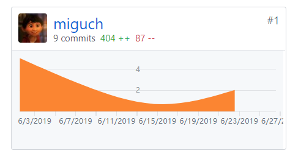

## 小组分工与贡献率说明

### 一、小组分工

|   学号   |  姓名  |             分工             | 贡献率 |
| :------: | :----: | :--------------------------: | :----: |
| 16340025 | 陈慕远 |  项目整体测试，协助后端开发  | 16.0%  |
| 16340023 | 陈明亮 |  服务端开发、测试，项目管理  | 18.0%  |
| 16340024 | 陈铭涛 |    数据库开发，docker部署    | 18.0%  |
| 16340006 |  蔡倓  | UI界面设计，协助小程序端开发 | 17.5%  |
| 16340008 | 蔡梓珩 |  小程序端开发，小程序端测试  | 17.5%  |
| 16340022 | 陈军萌 |    PM，需求分析，项目管理    | 13.0%  |

### 二、制品与贡献率

|      |    制品+     | 陈慕远 | 陈明亮 | 陈铭涛 | 蔡倓 | 蔡梓珩 | 陈军萌 |
| :--: | :----------: | :----: | :----: | :----: | :--: | :----: | :----: |
| 源码 |    服务端    |   -    |  100%  |   -    |  -   |   -    |   -    |
| 源码 |    数据库    |   -    |   -    |  100%  |  -   |   -    |   -    |
| 源码 |   小程序端   |   -    |   -    |   -    | 10%  |  90%   |   -    |
| 交互 |    UI设计    |   -    |   -    |   -    | 90%  |  10%   |   -    |
| 测试 | 后台测试代码 |  20%   |  80%   |   -    |  -   |   -    |   -    |
| 测试 | 系统测试报告 |  100%  |   -    |   -    |  -   |   -    |   -    |
| 文档 |   前期调研   |   -    |   -    |   -    |  -   |   -    |  100%  |
| 文档 |   需求规格   |   -    |  10%   |  10%   |  -   |   -    |  80%   |
| 文档 |   架构设计   |   -    |  80%   |  20%   |  -   |   -    |   -    |
| 文档 |   API设计    |   -    |  100%  |   -    |  -   |   -    |   -    |

### 三、成员Git log记录

#### 16340025 陈慕远

(Dashboard && Emtm-Server && Documents)

#### 16340023 陈明亮

(Dashboard && Emtm-Server && Documents)

#### 16340024 陈铭涛

(Dashboard && Emtm-DB && Emtm-Verify && Emtm-Web && Documents)

#### 16340006 蔡倓

(Dashboard && Emtm-Wxcode)

#### 16340008 蔡梓珩

(Dashboard && Emtm-Wxcode)

#### 16340022 陈军萌

(Dashboard)

