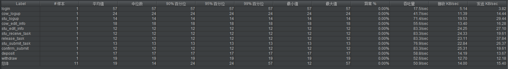
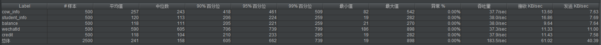
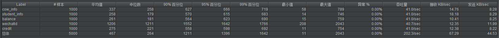
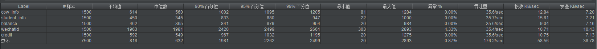
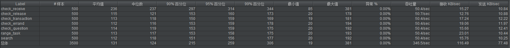
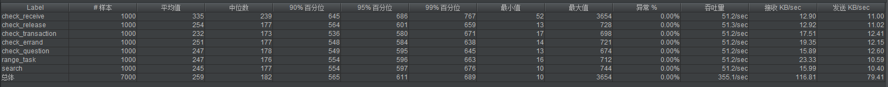
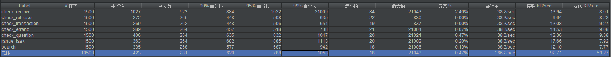

# 综合测试报告

## 测试目的

- 测试以寻找系统存在的缺陷，以便修复与预防bug的产生
- 评估测试执行过程
- 分析测试结果，评估软件质量

## 测试项目

### 功能测试

分别在Ios端与Android端测试微信小程序的功能是否正确运行，运行的效果是否满足需求。

### 性能测试

- 后端服务器地址：https://emtm.miguch.com
- 测试工具：JMeter
- 测试设备：Win10
- 测试环境：Java8.0，jdk1.8.0

对后端服务器进行性能测试，目的在于：

- 评估系统能力，测试中得到的负荷与响应时间数据可被用于验证所构建的模型的能力，并帮助做出决策
- 寻找系统瓶颈，进行系统调优
- 检测软件中的问题
- 验证软件的稳定性与可靠性

性能测试使用JMeter进行，首先配置其测试参数，录制测试脚本，最后根据生成的聚合报告来评估分析系统的性能，其中主要是对后端的响应性能进行测试，可得到其在预定环境及负载下的响应速度、通信效率、设备效率和执行效率。

> 注：本机网络配置可能影响测试结果

**参数设置**

|      参数名      |     值     |
| :--------------: | :--------: |
|    并发用户数    | 50/100/150 |
| 单个用户操作次数 |     10     |
|   脚本录制方法   |    自动    |
|   模拟路线类型   |   校园网   |

JMeter聚合报告参数解析：

- Label：JMeter的每个HTTP Request的name属性值
- Samples：请求数，表示本次测试一共发出了多少个请求
- Average：单个HTTP Request的平均响应时间
- Median：50%用户的响应时间
- 90% Line：90%用户的响应时间
- 95% Line：95%用户的响应时间
- 99% Line：99%用户的响应时间
- Min：最小响应时间
- Max：最大响应时间
- Error%：错误率，即错误请求数 / 请求总数
- Throughtput：吞吐量，每秒完成的请求数
- Received KB/Sec：每秒从服务器端接收到的数据量
- Sent KB/Sec：每秒发送到服务器端的数据量

JMeter聚合报告：

1. 初始用户信息配置

   

2. 并发数分别为50、100、150时，获取用户相关信息

可以看出响应时间逐渐增长，但仍有不错表现。

3. 并发数分别为50、100、150时，获取任务相关信息

可以看出跟获取用户信息相比，获取任务信息的代价要稍微高些，当并发数调整至150时其中一项测试的响应时间达到了20000左右。

**执行效率（平均响应时间）**

| 并发用户数 | cow_info | student_info | balance | wechatId | credit |
| :--------: | :------: | :----------: | :-----: | :------: | :----: |
|     50     |  0.257   |    0.120     |  0.118  |  0.590   | 0.118  |
|    100     |  0.337   |    0.258     |  0.261  |  1.206   | 0.275  |
|    150     |  0.614   |    0.450     |  0.462  |  1.963   | 0.592  |

| 并发用户数 | receive | release | transaction | errand | question | task  | search |
| :--------: | :-----: | :-----: | :---------: | :----: | :------: | ----- | ------ |
|     50     |  0.236  |  0.115  |    0.113    | 0.112  |  0.114   | 0.113 | 0.112  |
|    100     |  0.335  |  0.254  |    0.232    | 0.251  |  0.247   | 0.247 | 0.245  |
|    150     |  1.027  |  0.272  |    0.269    | 0.289  |  0.406   | 0.363 | 0.335  |

**后端性能测试分析**

根据聚合报告的结果可以看出，各api工作正常，在跑100个线程（模拟用户），且每个用户均运行十次的情况下，平均响应时间为0.346s（没有对数据库进行数据插入的测试，因为数据插入一次后再次插入相同的数据部分api会返回错误，与不进行插入相同）。在并发数为50~100时，错误率维持在0%，而当并发数来到150，一些api操作就开始出现错误。原因是读取的数据量较多，限制数据库对其他请求的响应。在测试过程中偶尔出现某个用户（线程）卡顿几秒钟，就是这个原因。总体来说，性能测试的结果还是符合预期的。

